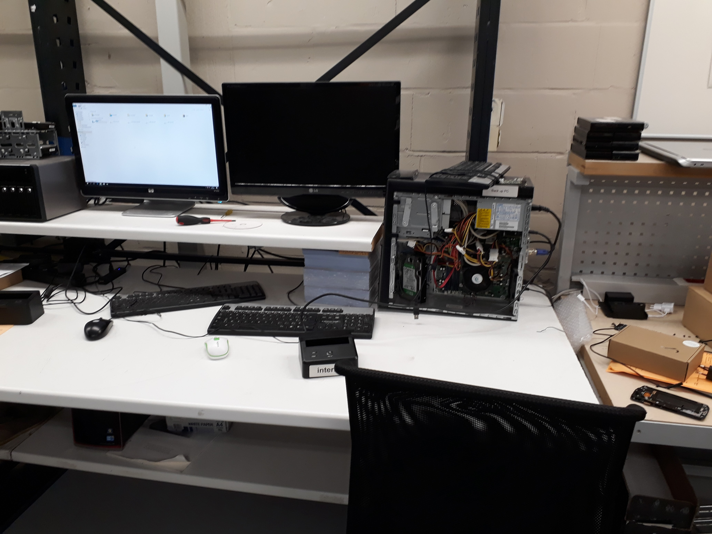
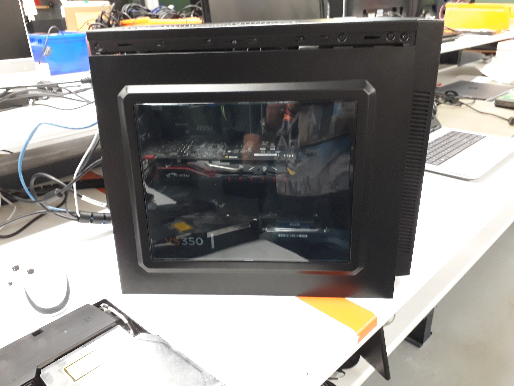

# Dinsdag 3 Oktober 2017
### Op bezoek bij een klant
> Vandaag heb ik eerst een halve dag meegewerkt met een hardware-engineer. 
Toen hij een oproep kreeg van een nieuwe klant, mocht ik meegaan om te kijken hoe hij het probleem zou oplossen.
Hier vertel ik kort wat er aan de hand was en hoe we dat hebben opgelost, samen met enkele dingen die ik ervan heb opgestoken.
Om geen problemen te veroorzaken bij de klant mocht ik geen foto's maken van deze uitstap. 
Hier som ik even de basisstappen op zoals ik ze heb geleerd van de hardware-engineer.

- Bij het binnenkomen eerst vragen stellen om meteen zoveel mogelijk info over het probleem te weten te komen.
- Eens in de IT-ruimte of serverafdeling, beginnen we altijd met de hardware na te kijken.
  Wanneer het probleem niet meteen duidelijk is, zal je softwarematig een antwoord moeten zoeken.

- Sluit je laptop aan en probeer een IP-adres te krijgen van de DNS.
Wanneer dit niet lukt, moet je extra documentatie gaan zoeken en kijken waar de fout zit.
- Indien dit een volledig nieuwe klant is en er dus geen documentatie te vinden is, zal je moeten back-tracen: de bron van het probleem zoeken. 
Best geef je je laptop nu een vast IP-adres zodat je verbinding met het internet hebt.
- Nu moet je weer even je ogen gebruiken: Kijk nog eens even naar alle toestellen en controlleer of ze werken.
- Hierna ga je de server even checken. 
  - Allereerst start je de server handmatig op. Als er een scherm bij hoort kan je daarmee werken, anders (zoals in ons geval) via Remote Desktop. 
Via dat programma kan je de naam of het IP-adres van de server ingeven, gevolgd door een gebruikersnaam en een paswoord.
  - Als de server afgesloten of uitgevallen was, 
  krijg je een ERROR-melding waarbij je moet ingeven waarom de server net afgesloten of uitgevallen was
(in dit geval: Power failure: UPS fail).
- Verander nu je vast IP-adres terug naar een automatisch IP-adres. 
Als de DNS werkt zal de server nu zelf een IP-adres aan de laptop geven (zoals het hoort).
- Hierna kan je enkele clients testen: pinautomaat, computer aan de balie ...
- Als alles werkt kan het bezoek afgerond worden: bij een nieuwe klant wordt er plaatselijk een bon gemaakt, afgedrukt en getekend. Bestaande klanten hebben een contract. 
Ze kopen “werkuren” van VanRoey.be en de gewerkte uren van die dag worden gewoon van het totaal aantal resterende werkuren afgetrokken.

### Service-desk
> In de namiddag heb ik nog even bij de service-desk mogen staan. Ook vandaag heb ik daar nuttige, praktische dingen bijgeleerd. 
- AMOLED-schermen zijn beter dan LCD-schermen.
-	Bij het vervangen van bv. een Samsung-scherm of het glaasje van de achterste camera 
moet men de lijm (een dubbezijdig plakkend voorwerp in de vorm van het onderdeel dat bevestigd moet worden) 
zeker stevig bevestigen en extra vastdrukken, zodat de lijm (en dus ook het scherm) niet loskomt.
> Ook heb ik even meegekeken naar een medewerker die desktops aan het onderzoeken was, zoals u kan zien op volgende foto's:

> Hier ziet u een selfie van mij, in de reparatiedienst achter de service-desk.

### Kennismaking VanRoey.be
> Het laatste uurtje heb ik in de eetzaal / vergaderzaal doorgebracht met mijn begeleidster. 
We hebben daar de onthaalbrochure van VanRoey.be even doorgenomen. De link naar mijn GIP-taak over de huisstijl van VanRoey.be zal hier later nog verschijnen.
- Dankzij deze bundel kon ik vandaag ook aan mijn GIP-taak rond de huisstijl van VanRoey.be beginnen. 
Binnenkort zal u hier een link vinden om deze taak te bekijken.
- Ik heb nu ook een beter zicht op het doorstromen van de werknemers. 
Eerst werken ze meestal 2 jaar aan de Service-desk, daarna gaan ze door naar de support afdeling. 
Nadat ze daar ook enkele jaren hebben gewerkt, kunnen ze doorstromen naargelang hun intresse. 
Een van die keuzes is bijvoorbeeld om "op de baan" te werken: naar klanten gaan en problemen te plekke oplossen.

*//elk puntje wordt geteld als zin -> 13 zinnen*

Klik [hier](https://github.com/MathiasV-immalle/StageVerslag/blob/master/Maandag.md) om Maandag 02/10/'17 te bekijken.

Klik [hier](https://github.com/MathiasV-immalle/StageVerslag/blob/master/Woensdag.md) om Woensdag 04/10/'17 te bekijken.
