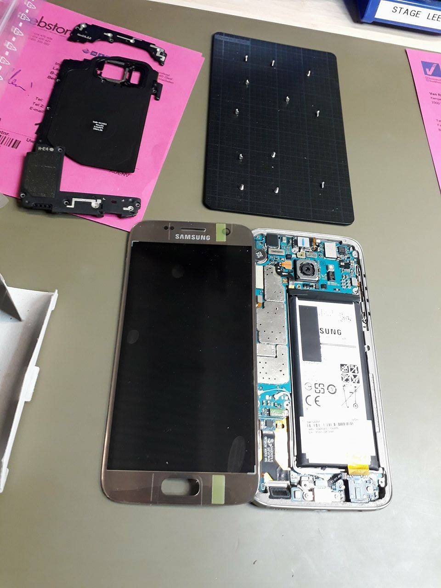

# StageVerslag VanRoey.be
### Hier kan u mijn stageverslag lezen, opgedeeld in dagen.
# Maandag 2 Oktober 2017
### Service-desk
> Vandaag heb ik vooral de werking van de servicedesk bestudeerd: hoe gaat men met klanten om, hoe geven ze de mensen "eerste hulp" en als belangrijkste, wat doen ze als die "eerste hulp" niet werkt en het toestel binnengenomen wordt?
Ik som kort even op wat ik vandaag precies heb gezien.
De link naar de lange versie is binnenkort beschikbaar.

- Kleine problemen worden meteen verholpen aan de balie, bij grotere problemen wordt het toestel binnengenomen.
- Bij het binnennemen van een toestel wordt een ticket gemaakt met de gegevens van de klant en het toestel zelf. Dit ticket wordt opgeslagen in een databank die toegankelijk is voor alle medewerkers van de reparatiedienst (die zich net achter de service-desk bevindt).
- De reparatiedienst bestaat uit een tiental mensen met elk een andere functie. Zij kunnen allemaal aan alle tickets aan. Wanneer ze een toestel gaan repareren, zetten ze het bijhorende ticket in een wachtrij bij hun naam zodat iedereen kan zien dat het toestel behandeld wordt. Wanneer het toestel af is wordt het ticket verplaatst naar een lijst met toestellen die afgehaald kunnen worden, ook per medewerker gesorteerd.
- Deze tickets worden gemaakt en gebruikt met behulp van het programma Microsoft Dynamics Navision. 
- Aangezien samenwerken belangrijk is, zag ik ook vaak de samenwerkingsruimte van OneNote verschijnen. Hier kan men real-time info communiceren aan de andere medewerkers zonder recht te staan of telefoontjes te onderbreken. Dit bespaart iedereen een hoop tijd.
- Men gebruikt Gmail om al het nodige e-mailverkeer te regelen en SwyxIt is hun belprogramma. 
  - Hier ziet u een typisch werkstation van een medewerker.

 
> Ik heb ook verschillende dingen bijgeleerd over het repareren van en de inhoud van een toestel.

- Vele vijsjes hebben een verschillende lading. Vandaar moet men ze goed sorteren en op dezelfde plaats terugsteken, anders kan dit zelfs voor kortsluiting op het moederbord zorgen.
- Een iPad repareren is een nachtmerrie.
- De binnenkant van een samsung-smartphone is veel handiger om te repareren dan een Apple-smartphone.
  - Hier ziet u een opengemaakte Samsung-smartphone.

 
> Op de werkvloer zit de sfeer goed. 

- Er staat altijd zachte muziek op, vooral rock-'n-roll en heavy metal, maar ook meezingers en populaire songs. 
- De gezellige babbels ontbreken niet, zowel over werk- als niet werk-gerelateerde onderwerpen.

*//elk puntje wordt geteld als zin -> 11 zinnen*

# Dinsdag 3 Oktober 2017
### Op bezoek bij een klant
> Vandaag heb ik eerst een halve dag meegewerkt met een hardware-engineer. 
Toen hij een oproep kreeg van een nieuwe klant, mocht ik meegaan om te kijken hoe hij het probleem zou oplossen.
Hier vertel ik kort wat er aan de hand was en hoe we dat hebben opgelost, samen met enkele dingen die ik ervan heb opgestoken.
Om geen problemen te veroorzaken bij de klant mocht ik geen foto's maken van deze uitstap. 
Hier som ik even de basisstappen op zoals ik ze heb geleerd van de hardware-engineer.

- Bij het binnenkomen eerst vragen stellen om meteen zoveel mogelijk info over het probleem te weten te komen.
- Eens in de IT-ruimte of serverafdeling, beginnen we altijd met de hardware na te kijken.
  Wanneer het probleem niet meteen duidelijk is, zal je softwarematig een antwoord moeten zoeken.

- Sluit je laptop aan en probeer een IP-adres te krijgen van de DNS.
Wanneer dit niet lukt, moet je extra documentatie gaan zoeken en kijken waar de fout zit.
- Indien dit een volledig nieuwe klant is en er dus geen documentatie te vinden is, zal je moeten back-tracen: de bron van het probleem zoeken. 
Best geef je je laptop nu een vast IP-adres zodat je verbinding met het internet hebt.
- Nu moet je weer even je ogen gebruiken: Kijk nog eens even naar alle toestellen en controleer of ze werken.
- Hierna ga je de server even checken. 
  - Allereerst start je de server handmatig op. Als er een scherm bij hoort kan je daarmee werken, anders (zoals in ons geval) via Remote Desktop. 
Via dat programma kan je de naam of het IP-adres van de server ingeven, gevolgd door een gebruikersnaam en een paswoord.
  - Als de server afgesloten of uitgevallen was, 
  krijg je een ERROR-melding waarbij je moet ingeven waarom de server net afgesloten of uitgevallen was
(in dit geval: Power failure: UPS fail).
- Verander nu je vast IP-adres terug naar een automatisch IP-adres. 
Als de DNS werkt zal de server nu zelf een IP-adres aan de laptop geven (zoals het hoort).
- Hierna kan je enkele clients testen: pinautomaat, computer aan de balie ...
- Als alles werkt kan het bezoek afgerond worden: bij een nieuwe klant wordt er plaatselijk een bon gemaakt, afgedrukt en getekend. Bestaande klanten hebben een contract. 
Ze kopen “werkuren” van VanRoey.be en de gewerkte uren van die dag worden gewoon van het totaal aantal resterende werkuren afgetrokken.

### Service-desk
> In de namiddag heb ik nog even bij de service-desk mogen staan. Ook vandaag heb ik daar nuttige, praktische dingen bijgeleerd. 
- AMOLED-schermen zijn beter dan LCD-schermen: wanneer AMOLED verbrandt, herstelt dit zichzelf na een korte tijd. Bij LCD herstelt dit niet. AMOLED is daardoor wel duurder. Ook geven AMOLED-schermen kleuren feller en mooier weer. Samsung gebruikt al 5 jaar de AMOLED schermen, Apple heeft nu net de iPhone 10 uitgebracht, de eerste (!) met het AMOLED scherm. 
-	Bij het vervangen van bv. een Samsung-scherm of het glaasje van de achterste camera 
moet men de lijm (een dubbezijdig plakkend voorwerp in de vorm van het onderdeel dat bevestigd moet worden) 
zeker stevig bevestigen en extra vastdrukken, zodat de lijm (en dus ook het scherm) niet loskomt.
> Ook heb ik even meegekeken naar een medewerker die desktops aan het onderzoeken was, zoals u kan zien op volgende foto's:

### Kennismaking VanRoey.be
> Het laatste uurtje heb ik in de eetzaal / vergaderzaal doorgebracht met mijn begeleidster. 
We hebben daar de onthaalbrochure van VanRoey.be even doorgenomen. De link naar mijn GIP-taak over de huisstijl van VanRoey.be zal hier later nog verschijnen.
- Dankzij deze bundel kon ik vandaag ook aan mijn GIP-taak rond de huisstijl van VanRoey.be beginnen. 
Binnenkort zal u hier een link vinden om deze taak te bekijken.
- Ik heb nu ook een beter zicht op het doorstromen van de werknemers. 
Eerst werken ze meestal 2 jaar aan de Service-desk, daarna gaan ze door naar de support afdeling. 
Nadat ze daar ook enkele jaren hebben gewerkt, kunnen ze doorstromen naargelang hun intresse. 
Een van die keuzes is bijvoorbeeld om "op de baan" te werken: naar klanten gaan en problemen te plekke oplossen.

*//elk puntje wordt geteld als zin -> 13 zinnen*

# Woensdag 4 Oktober 2017
### Remote Support
> Vandaag heb ik maar een half dagje gewerkt, tot 13u. Dit idee kwam van het bedrijf zelf omdat ze vaak merken dat studenten in het midden van de week toch wel extra tijd kunnen gebruiken om notities bij te werken. Maar dat wil niks zeggen dat ik op een half dagje niks heb kunnen doen. Vandaag kreeg ik zicht op de verschillende softwarepakketten die VanRoey.be gebruikt, en ook kreeg ik info over hun fysieke én virtuele servers. Jammer genoeg kreeg ik wegens privacy-regels geen plannetje van de server-indeling of screenshots van de programma's. Wel heb ik een afgewerkt Ticket gekregen van een medewerker zelf. Zo overtreed ik geen privacy-regels en kunnen er geen problemen met klanten ontstaan. Dit Ticket kan u onderaan terugvinden. Eerst vertel ik kort wat ik vandaag precies gezien heb.
##### Ticketingsysteem: Microsoft Navision
- Microsoft Navision is het programma dat VanRoey.be gebruikt als Ticketingsysteem. Tickets worden handmatig aangemaakt met input die verkregen wordt via e-mail, telefoon, of via een online portal: de website.
  - Eerst maak je een nieuw ticket aan en selecteer je de klant.
  - Vervolgens selecteer je het soort incident: Major Incident - Incident - Request Fulfilment
  - Vervolgens selecteer je een prioriteit: Zeer hoog - Hoog - Normaal - Laag
  - Hierna worden de gegevens van de gebruiker zelf (en dus niet van de bedrijfsleider of dergelijke) genoteerd, en kunnen er eventuele opmerkingen geplaatst worden.
- Enkele opmerkingen:
  - Sommige klanten kopen een SLA-contract. Hier bestaan twee versies: één van 1uur en één van 4uur. Dit wil zeggen dat wanneer een klant met een probleem dit contract heeft, VanRoey.be binnen de bijhorende termijn moet reageren op het probleem, anders zullen zij een boete moeten betalen. De SLA-contracthouders worden dus sneller geholpen dan klanten zonder dit contract.
  - Sommige klanten kopen een Service-contract. Dit houd in dat de klanten 24/24 en 7/7 geholpen moeten worden door VanRoey.be, dus ook in weekends en vakanties. Hiervoor worden er techniekers stand-by gehouden, dit werkt via een beurtrollensysteem.
  - VanRoey.be is momenteel aan het kijken naar een ander systeem waar ik de naam niet van mag weten, maar met dat programma zouden er veel tickets volautomatisch kunnen worden aangemaakt, en zo zouden er ook screenshots mee opgeslagen kunnen worden (wat tot nu toe niet mogelijk was).
##### Serverniveau: VMware
- VMware: Hypervisor. Via dit programma zet VanRoey.be zijn virtuele servers op zijn fysieke servers.
  - De cluster (groep samenwerkende servers) van VanRoey.be bestaat uit 4 fysieke servers met elk 140GB werkgeheugen (en andere details). Waarom deze servers elk zoveel werkgeheugen hebben is, wanneer er 3 servers uitvallen (uitzonderlijk) moet de overblijvende server alles op zichzelf kunnen draaien.
[VMWare](https://www.vmware.com/nl.html)
 ##### Securityniveau
- Fortinet: Security vendor. Vanroey.be heeft niet één, niet geen, maar twee firewalls (waarvan 1 reserve uiteraard) met de eerste failover door Telenet (omdat VanRoey.be een partner is van Telenet), en een tweede door bijvoorbeeld Proximus (hangt er een beetje van af).
[Fortinet](https://www.fortinet.com/)
##### Switchingniveau
- VanRoey.be heeft één core-switch, in een cluster met andere switchen. De core-switch is een stack van switchen: Allerlei switchen boven elkaar in één of meerdere kasten vlak naast elkaar. Dit brengt mooie voordelen met zich mee zoals betere performantie, en zo kunnen bijvoorbeeld ook twee poorten van 1gigabit gebundeld worden tot één poort van 2gigabit, wat zorgt voor een mooie Uplink.
##### Monitoringpakket
- Assurline is een eigen programma dat VanRoey.be gebruikt om servers van hun klanten te monitoren. Klanten die deze extra feature wensen, moeten uiteraard een betalend contract tekenen. 
[Assurline](https://www.vanroey.be/Projecten/210-assurline-beheers-uw-omgeving/)

> Hier ziet u een foto van mijn tijdelijke werkplaats vandaag:

*//elk puntje wordt geteld als zin -> 12 zinnen*

# Donderdag 5 Oktober 2017
### Navision Support
> Vandaag heb ik eerst een halve dag bij Navision Support gestaan. Daar onderhouden ze vooral de SQL database achter Microsoft Dynamics NAV en maken ze nieuwe tickets, maar beheren ze ook het volledige Microsoft Dynamics NAV pakket (de ERP, enterprise recource planning). Navision Support beheert de "NAV" mailbox, waarin alle vragen en klachten binnenkomen van mensen die in hun bedrijf ook NAV gebruiken. Bij sommige, erg belangrijke tickets proberen ze meteen een oplossing te vinden, andere tickets moeten opgelost worden bij Remote Support. Ik heb hier vooral extra info gekregen over de gebruikte software, en deze zal ik hier met jullie meedelen.
- Nieuwe tickets aanmaken is makkelijker dan ooit, de klant kan gewoon naar een webadres surfen, zijn vraag ingeven en deze vraag volledig volgen tot deze opgelost is. De klant kan perfect volgen wie er nu met zijn vraag bezig is, en wat ze ermee doen.
[Microsoft Dynamics NAV](https://www.microsoft.com/nl-be/dynamics365/nav-overview)
  - Ik heb nog even een screenshot gevraagd aan mijn begeleider zodat jullie toch een idee hebben over hoe NAV eruitziet. Dit is de menu-pagina: 

- VanRoey.be gebruikt in de winkels mobiele scanners om bijvoorbeeld stock te bepalen. Deze scanners staan in directe verbinding met de SQL database achter Microsoft Dynamics NAV. Zo moeten de werknemers niet alles handmatig ingeven en zo besparen ze een hoop werk, tijd en dus ook geld! Deze scanners staan in NAV onder de naam MWS: Mobile solutions.
- Greenshot is bij VanRoey.be het standaard programma om screenshots mee te nemen.
[Greenshot](http://getgreenshot.org/)
- SwyxIT is hun belprogramma, zoals ik al eerder heb vermeld. Extra info: SwyxIT is extra handig te gebruiken om dat je de lijn gewoon kan doorgeven door deze door te slepen naar een andere persoon (drag and drop). Ook zitten alle personen van alle afdelingen in het programma, waardoor je een klant heel snel naar de juiste persoon kan doorschakelen.
[SwyxIT](https://www.swyx.nl/producten/unified-communications/swyxit-for-windows.html)
- Het intranet van VanRoey.be is een soort van uitgebreide Windows verkenner. Het enige verschil is dat je tags kan toevoegen aan de bestanden. Dit zorgt ervoor dat je je bestanden kan filteren op tags, waardoor je makkelijker je bestanden terugvindt.
- VPN (virtual private network) wordt vaak gebruikt om een klein probleem op een server van op afstand op te lossen, waardoor er geen technieker moet langskomen. Met behulp van het programma FortiClient kan men de server van op een afstand beheren en de fouten oplossen. Een andere manier waarop ze dit ook soms doen is via RDP (remote desktop protocol, beter gekend als extern bureaublad). Zo kan men ook het scherm overnemen en inloggen op de servers.
[FortiClient](http://www.forticlient.com/)
- FTP (file transfer protocol) wordt vaak gebruikt om aan de bestanden van een andere computer te kunnen. Meestal werkt dit via een FTP-server, beveiligd met een username en password (uiteraard!).
- Microsoft Visio Professional is het programma dat men gebruikt om snel gekrabbelde schema's professioneel uit te werken zodat ze die netjes kunnen voorleggen bij de klant.
[Microsoft Visio Professional](https://products.office.com/nl-be/visio/flowchart-software?tab=tabs-1)
> Ook ben ik nog iets anders tegengekomen, maar eerder informatief.
- Sommige klanten hebben een prepaid contract, ze betalen in het begin een grote som geld, en bij elke support die er wordt uitgevoerd wordt het bedrag gewoon inmindering gebracht, tot het uiteindelijk "op" is. In dat geval kan het bedrijf kiezen om de samenwerking stop te zetten of een nieuw contract aan te kopen. 
### Remote Support
> In de namiddag heb ik ook nog een paar dingen bijgeleerd op de Remote Support. Deze zijn ook louter informatief.
- Wanneer er spam-mails binnenkomen, wordt de zender gewoon toegevoegd aan de block-list: een lijst met alle geblokkeerde zenders.
- Bij Office 2007 is er een fout gebeurt bij een update waardoor Outlook gedeeltelijk in het Zweeds komt te staan. Dit is makkelijk op te lossen door de update ongedaan te maken en Outlook.exe / renamefoldernames uit te voeren.

*//elk puntje wordt geteld als zin -> 11 zinnen*

# Vrijdag 6 Oktober 2017
### Service-desk
> Vandaag heb ik weinig nieuws gezien, maar dat wil niet zeggen dat ik niks heb gedaan!
- Ik heb extra foto's genomen, van het gebouw bijvoorbeeld:

- Ik heb zoals altijd mijn ogen opengehouden, en vandaag heb ik laptop-reparaties bekeken. Hieronder vind je een foto:

- Ik heb uitgebreid de tijd genomen om eens goed te babbelen met mijn collega's. Ik heb de banden nog wat verstevigd zodat er misschien een goed woordje gedaan kan worden over mij, wanneer ik later misschien studentenjob of dergelijke bij VanRoey.be wil doen.
- Met dank aan een van mijn collega's heb ik de nodige moed bij elkaar geraapt om voor een 100% responsive site te ontwerpen voor mijn GIP. Zo kan ik mijn eindwerk is stijl maken en als kers op de taart extra inzet, interesse en kennis tonen.
- Ik heb met fotoshop al een aantal foto's bewerkt zodat ze klaar zijn om in mijn GIP-site gebruikt te worden.
- Ik heb nog veel gewerkt aant andere taken en verslagen, waarbij ik soms de volgorde ben vergeten. Vandaar deze net iets latere commit.
> Al bij al is het nog een drukke dag geworden (net zoals de andere dagen trouwens), maar het was zeker een van de fijnste dagen. 

*//elk puntje wordt geteld als zin -> 6 zinnen*

#### Dit is het einde van mijn stageverslag!
#### Binnenkort komt hier nog een link naar mijn GIP-site met meer info en meer afbeeldingen, hier wordt hard aan gewerkt!
#### Bedankt voor uw tijd, bekijk nog even mijn andere repo's en tot binnenkort!

# Mathias Vansant
## 6ITN, nr. 10
