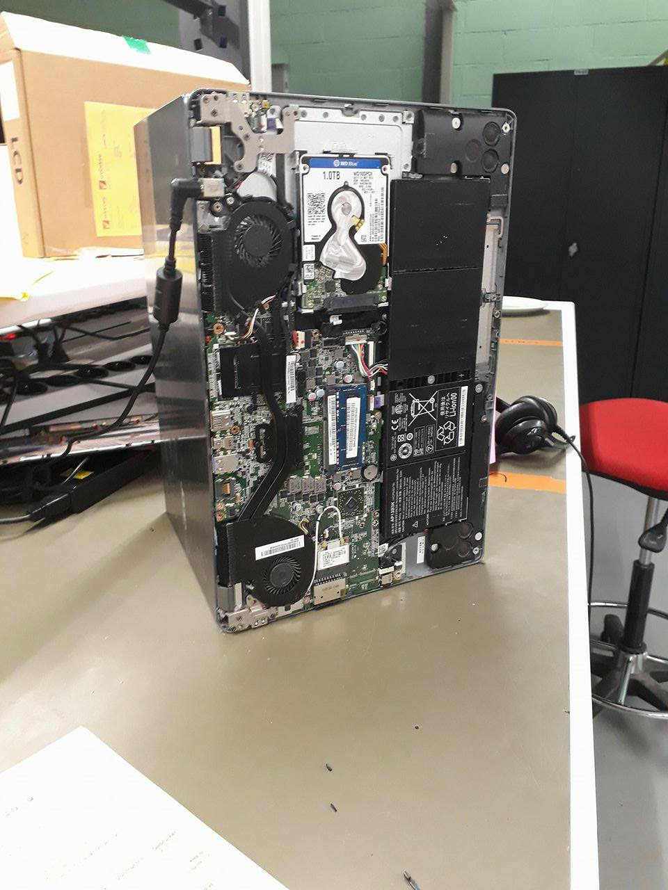

# Vrijdag 6 Oktober 2017
### Service-desk
> Vandaag heb ik weinig nieuws gezien, maar dat wil niet zeggen dat ik niks heb gedaan!
- Ik heb extra foto's genomen, van het gebouw en de bushalte waar ik afstap bijvoorbeeld:

- Ik heb zoals altijd mijn ogen opengehouden, en vandaag heb ik laptop-reparaties bekeken. Hieronder vind je een foto:

- Ik heb uitgebreid de tijd genomen om eens goed te babbelen met mijn collega's. Ik heb de banden nog wat verstevigd zodat er misschien een goed woordje gedaan kan worden over mij, wanneer ik later misschien studentenjob of dergelijke bij VanRoey.be wil doen.
- Met dank aan een van mijn collega's heb ik de nodige moed bij elkaar geraapt om voor een 100% responsive site te ontwerpen voor mijn GIP. Zo kan ik mijn eindwerk is stijl maken en als kers op de taart extra inzet, interesse en kennis tonen.
- Ik heb met fotoshop al een aantal foto's bewerkt zodat ze klaar zijn om in mijn GIP-site gebruikt te worden.
- Ik heb nog veel gewerkt aant andere taken en verslagen, waarbij ik soms de volgorde ben vergeten. Vandaar deze net iets latere commit.
> Al bij al is het nog een drukke dag geworden (net zoals de andere dagen trouwens), maar het was zeker een van de fijnste dagen. 

*//elk puntje wordt geteld als zin -> 6 zinnen*

#### Dit is het einde van mijn stageverslag!
#### Binnenkort komt hier nog een link naar mijn GIP-site met meer info en meer afbeeldingen, hier wordt hard aan gewerkt!
#### Bedankt voor uw tijd, bekijk nog even mijn andere repo's en tot binnenkort!

Klik [hier](https://github.com/MathiasV-immalle/StageVerslag/blob/master/Donderdag.md) om Donderdag 05/10/'17 te bekijken.

Klik [hier](https://github.com/MathiasV-immalle/StageVerslag/blob/master/README.md) om terug naar het menu te gaan.
